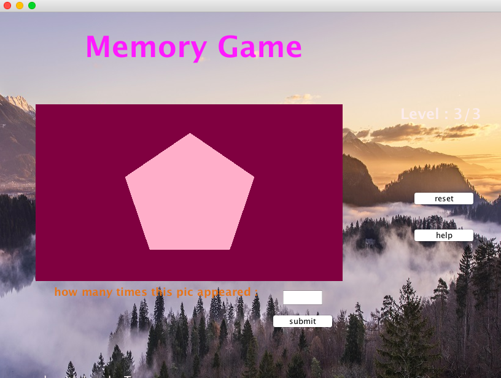

# memoryGame
### A java based game to check your memory
---  
To play the game, run `java -jar "memoryGame.jar"` from the dist directory.  

## How to play:  
1. During each round, a series of images will flash on the screen.

2. At the end of the round, you will be presented with a single image, and you must enter the number of times that image appeared on screen during the round.  

3. If you are correct, you will move on to the next round. If you are incorrect, you must click the **restart** button to retry the level. 
